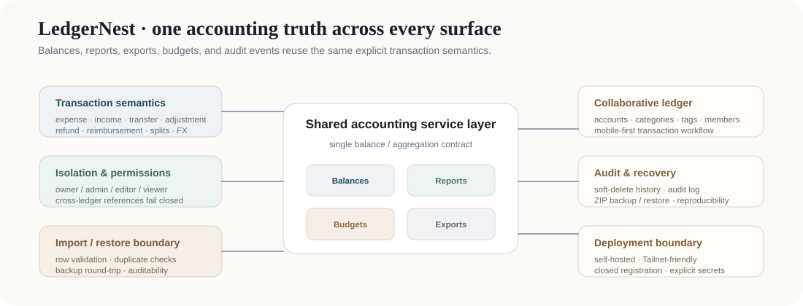

# LedgerNest

**Self-hosted, mobile-first collaborative accounting with explicit ledger semantics.**

LedgerNest is a modular Django application for small teams or households that need shared bookkeeping without giving up control of their data. Its engineering focus is not decorative dashboards; it is keeping balances, reports, exports, permissions, audit history, and backup/restore behavior consistent under one accounting contract.

  

## What it demonstrates

| Area | Contract |
| --- | --- |
| Accounting semantics | expense / income / transfer / adjustment / refund / reimbursement remain distinct; transfer does not change total book value |
| Multi-currency | original amount, FX rate, and base-currency amount are stored explicitly |
| Split transactions | split totals are validated and reports avoid double counting |
| Isolation | owner / admin / editor / viewer roles plus cross-ledger reference checks |
| Reporting | dashboards, reports, and exports reuse the same transaction service logic |
| Recovery | soft-delete semantics, audit log, import validation, and ZIP backup / restore |
| Deployment | self-hosted Django + PostgreSQL, mobile-first UI, Tailnet-friendly deployment boundary |

## Stack

Python 3.12+ · Django 5.2 · PostgreSQL · HTMX · Alpine.js · Tailwind CSS · ECharts · pytest · Docker

The main Chinese README contains the complete feature matrix, deployment guide, report definitions, permission model, import format, and operational notes: [README.md](README.md).

## Verification

The repository includes regression coverage for authentication, permissions, balances, transfers, refunds/reimbursements, splits, multi-currency accounting, report aggregation, import/export behavior, audit history, backup/restore, and cross-ledger isolation.

## Boundary

LedgerNest is designed for self-hosted use. Runtime databases, secrets, local agent state, and user financial data are not part of the public repository. Public-release CI rejects tracked runtime state and real environment files.

MIT licensed.